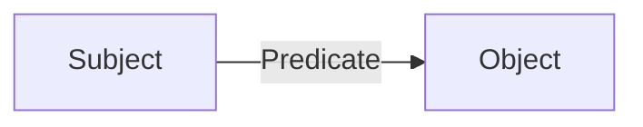
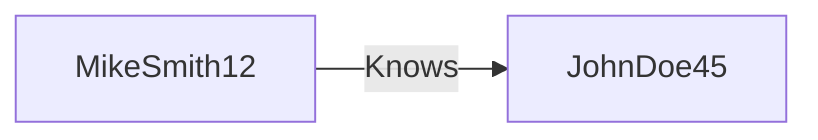
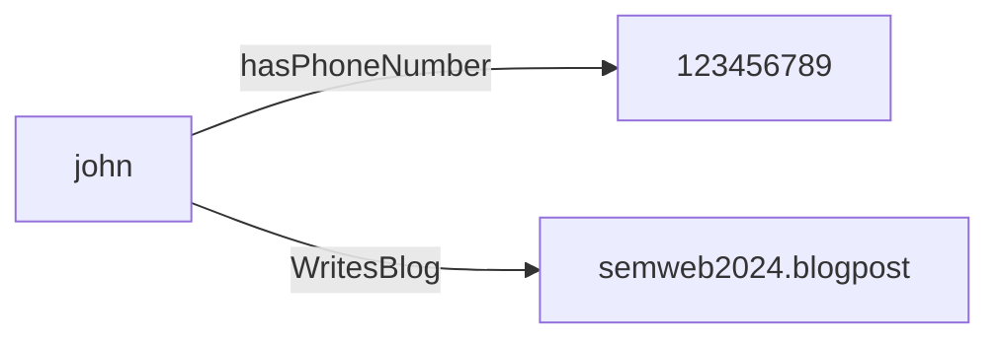

# How to represent facts (part 1):-

## RDF (Resource Description Framework):-

### Resource:-

> 1. can be everything (in principle)
> 2. must be uniquely identified and be refrencecable simply via an IRI

### Description:-

> 1. Description of resources via representing properties and relation ship among resources
> 2. Relationships can be represented as graphs

### Framework:-

> 1. Combination of web based protocols (URI,IRI,HTTP,XML)
> 2. Based on formal models (semantics)
> 3. Defines all allowed relationships among resources

<br>

### RDF triple:-

> Triples (also known as facts) are a way to express graph data.
>
> RDF Triple consists of following three parts:-
>
> > 1.  Subject:- The resource being described.(IRI)
> > 2.  Predicate:- The property or attribute of the subject.(IRI)
> > 3.  Object:- The value or resource that is linked to the subject by the predicate.(IRI or Literal)



### Example:-

> (<uri://people#MikeSmith12>)---(<http://xmlns.com/foaf/0.1/knows>)--->(<uri://people#JohnDoe45>)



### Literals:-

> 1. Typed literals can be expressed via XML schema data-type
> 2. Namespace for typed literals:- <http://www.w3.org/2001/XMLSchema>
>
> > Example:- "Semantics"^^<<http://www.w3.org/2001/XMLSchema#string>>
>
> 4. Language tags denotes the natural language of the text:-
>
> > Example:- "Semantik"@de,"Semantics@en

### Notations or Formats :-

> 1. **N3**:-

```
{<uri://people#MikeSmith12>,
 <http://xmlns.com/foaf/0.1/knows>,
 <uri://people#JohnDoe45>} .
```

> > >
>
> 2. **Turtle(Terse RDF triple language) :-**
>    > - **Extension of N3**
>    > - **URI's are in angle brackets**
>    > - **Literals in quotations marks**
>    > - **Triple ends with period**
>    > - **White spaces will be ignored**

```
@prefix rdf:<<http://www.w3.org/1999/02/22-rdf-syntax-ns#>>.
@prefix pers:<<http://college.in/Personal#>>.
@base <<http://college.in/Student>>.

:JohnDoe pers: hasPhoneNumber "1234567890";
        pers: WritesBlog<<http://semweb2024.blogpost.com>> .
```

> 3. **RDF-XML Serialization :-**

```
<rdf:RDF
    xmlns:rdf="http://www.w3.org/1999/02/22-rdf-syntax-ns#"
    xmlns:pers="http://college.in/Personal#"
    xml:base="http://college.in/Student">

<rdf:Description rdf:about="http://college.in/Student/John">
    <pers:hasPhoneNumber>1234567890</pers:hasPhoneNumber><pers:WritesBlog rdf:resource="http://semweb2024.blogpost.com"/>
</rdf:Description>
</rdf:RDF>
```


