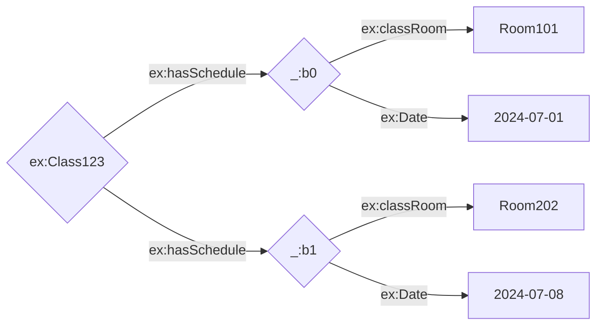
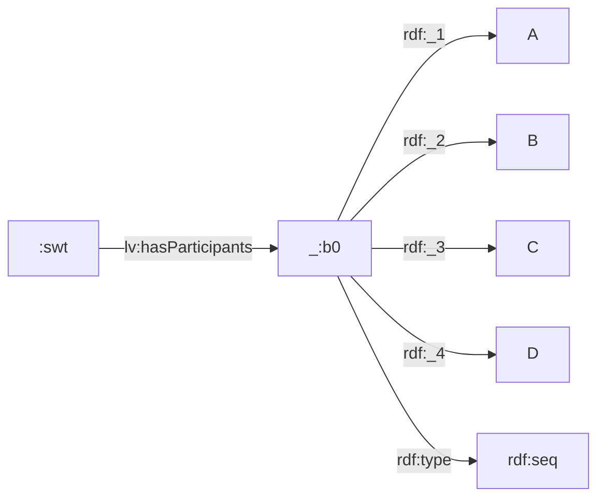
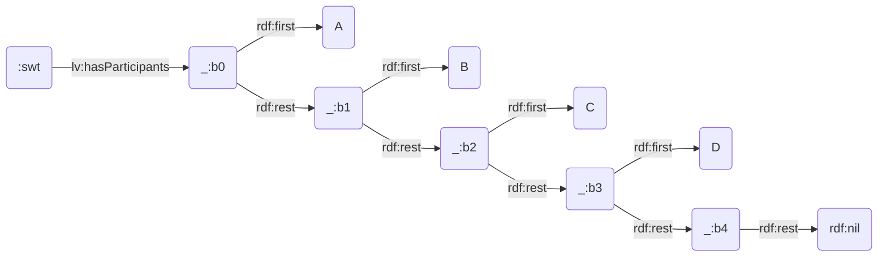

# How to represent facts (part3) :-

## Blank nodes :-

> - A blank node (or bnode) is a node in an RDF graph that represents a resource without using a URI or a literal value. Blank nodes are useful when you want to make statements about resources for which you do not have a URI or when you want to group data without assigning a global identifier.

### Characteristics of a bnode :-

> - 1. Anonymous Resources: Blank nodes are used to describe resources anonymously.
> - 2. Local Scope: The identifiers of blank nodes are only meaningful within the context of a single RDF graph. They cannot be referenced from outside that graph.
> - 3. Internal Identifiers: In RDF syntax (like Turtle or RDF/XML), blank nodes are typically given internal identifiers like _:b1, _:b2, etc.
>
> example :-

Turtle format:-

```
@prefix ex: <http://example.org/> .
@prefix rdf: <http://www.w3.org/1999/02/22-rdf-syntax-ns#> .

ex:Class123 ex:hasSchedule [
    ex:date "2024-07-01" ;
    ex:classRoom "Room 101"
  ],
  [
    ex:date "2024-07-08" ;
    ex:classRoom "Room 202"
  ] .
```

Xml/Rdf format :-

```

<rdf:RDF xmlns:rdf="http://www.w3.org/1999/02/22-rdf-syntax-ns#"
         xmlns:ex="http://example.org/">
  <rdf:Description rdf:about="http://example.org/Class123">
    <ex:hasSchedule>
      <rdf:Description>
        <ex:date>2024-07-01</ex:date>
        <ex:classRoom>Room 101</ex:classRoom>
      </rdf:Description>
    </ex:hasSchedule>
    <ex:hasSchedule>
      <rdf:Description>
        <ex:date>2024-07-08</ex:date>
        <ex:classRoom>Room 202</ex:classRoom>
      </rdf:Description>
    </ex:hasSchedule>
  </rdf:Description>
</rdf:RDF>

```



## Lists :-

> - lists are a way to represent ordered collections of resources. RDF provides a standard vocabulary to describe lists, which is part of the RDF Schema (RDFS). RDF provides two primary mechanisms for grouping resources:
>
> > - Containers and Collections. Both serve the purpose of grouping related resources, but they differ in structure, intended use, and the semantics of ordering.
> >
> > 1.  Containers are used to group resources, and they come in three types:
> >
> > > 1. rdf:Bag is used for collections where the order does not matter and duplicate entries are allowed.

```
@prefix rdf: <http://www.w3.org/1999/02/22-rdf-syntax-ns#> .

:myBag rdf:type rdf:Bag ;
       rdf:_1 :item1 ;
       rdf:_2 :item2 ;
       rdf:_3 :item3 .
```

```
<rdf:RDF xmlns:rdf="http://www.w3.org/1999/02/22-rdf-syntax-ns#">
  <rdf:Bag rdf:about="http://example.org/myBag">
    <rdf:li rdf:resource="http://example.org/item1"/>
    <rdf:li rdf:resource="http://example.org/item2"/>
    <rdf:li rdf:resource="http://example.org/item3"/>
  </rdf:Bag>
</rdf:RDF>
```

> > > 2. rdf:Seq is used for collections where the order matters.

```
@prefix rdf: <http://www.w3.org/1999/02/22-rdf-syntax-ns#> .

:mySeq rdf:type rdf:Seq ;
       rdf:_1 :item1 ;
       rdf:_2 :item2 ;
       rdf:_3 :item3 .
```

```
@prefix rdf: <http://www.w3.org/1999/02/22-rdf-syntax-ns#> .

:mySeq rdf:type rdf:Seq ;
       rdf:_1 :item1 ;
       rdf:_2 :item2 ;
       rdf:_3 :item3 .
```

> > > 3. rdf:Alt is used for collections where the items are alternatives, and typically, one of them is expected to be selected.

```
@prefix rdf: <http://www.w3.org/1999/02/22-rdf-syntax-ns#> .

:myAlt rdf:type rdf:Alt ;
       rdf:_1 :item1 ;
       rdf:_2 :item2 ;
       rdf:_3 :item3 .
```

```
<rdf:RDF xmlns:rdf="http://www.w3.org/1999/02/22-rdf-syntax-ns#">
  <rdf:Alt rdf:about="http://example.org/myAlt">
    <rdf:li rdf:resource="http://example.org/item1"/>
    <rdf:li rdf:resource="http://example.org/item2"/>
    <rdf:li rdf:resource="http://example.org/item3"/>
  </rdf:Alt>
</rdf:RDF>
```

> > > 2.  Collections are used to represent ordered lists of resources, ensuring a strict sequence using rdf:first and rdf:rest. This structure creates a closed list where the end is explicitly indicated by rdf:nil.

```
@prefix rdf: <http://www.w3.org/1999/02/22-rdf-syntax-ns#> .

:myList rdf:first :item1 ;
        rdf:rest [ rdf:first :item2 ;
                   rdf:rest [ rdf:first :item3 ;
                              rdf:rest rdf:nil ] ] .
```

```
<rdf:RDF xmlns:rdf="http://www.w3.org/1999/02/22-rdf-syntax-ns#">
  <rdf:Description rdf:about="http://example.org/myList">
    <rdf:first rdf:resource="http://example.org/item1"/>
    <rdf:rest>
      <rdf:Description>
        <rdf:first rdf:resource="http://example.org/item2"/>
        <rdf:rest>
          <rdf:Description>
            <rdf:first rdf:resource="http://example.org/item3"/>
            <rdf:rest rdf:resource="http://www.w3.org/1999/02/22-rdf-syntax-ns#nil"/>
          </rdf:Description>
        </rdf:rest>
      </rdf:Description>
    </rdf:rest>
  </rdf:Description>
</rdf:RDF>

```

> - Container list example :-

```
@prefix rdf: <http://www.w3.org/1999/02/22-rdf-syntax-ns#> .
@prefix lv: <http://hpi-web.de/Lecture#> .
@prefix : <http://hpi-web.de/> .

:swt lv:hasParticipants [
  a rdf:Seq;
  rdf:_1 <A>;
  rdf:_2 <B>;
  rdf:_3 <C>;
  rdf:_4 <D>
] .
```



> - Collectionl ist example :-

```
@prefix rdf: <http://www.w3.org/1999/02/22-rdf-syntax-ns#> .
@prefix lv: <http://hpi-web.de/Lecture#> .
@prefix : <http://hpi-web.de/> .

:swt lv:hasParticipants (
  <A>
  <B>
  <C>
  <D>
) .
```



