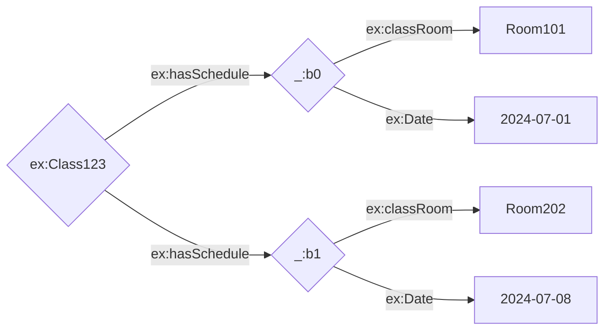

# How to represent facts (part3) :-

## Blank nodes :-

> - A blank node (or bnode) is a node in an RDF graph that represents a resource without using a URI or a literal value. Blank nodes are useful when you want to make statements about resources for which you do not have a URI or when you want to group data without assigning a global identifier.

### Characteristics of a bnode :-

> - 1. Anonymous Resources: Blank nodes are used to describe resources anonymously.
> - 2. Local Scope: The identifiers of blank nodes are only meaningful within the context of a single RDF graph. They cannot be referenced from outside that graph.
> - 3. Internal Identifiers: In RDF syntax (like Turtle or RDF/XML), blank nodes are typically given internal identifiers like _:b1, _:b2, etc.
>
> example :-

Turtle format:-

```
@prefix ex: <http://example.org/> .
@prefix rdf: <http://www.w3.org/1999/02/22-rdf-syntax-ns#> .

ex:Class123 ex:hasSchedule [
    ex:date "2024-07-01" ;
    ex:classRoom "Room 101"
  ],
  [
    ex:date "2024-07-08" ;
    ex:classRoom "Room 202"
  ] .
```

Xml/Rdf format :-

```

<rdf:RDF xmlns:rdf="http://www.w3.org/1999/02/22-rdf-syntax-ns#"
         xmlns:ex="http://example.org/">
  <rdf:Description rdf:about="http://example.org/Class123">
    <ex:hasSchedule>
      <rdf:Description>
        <ex:date>2024-07-01</ex:date>
        <ex:classRoom>Room 101</ex:classRoom>
      </rdf:Description>
    </ex:hasSchedule>
    <ex:hasSchedule>
      <rdf:Description>
        <ex:date>2024-07-08</ex:date>
        <ex:classRoom>Room 202</ex:classRoom>
      </rdf:Description>
    </ex:hasSchedule>
  </rdf:Description>
</rdf:RDF>

```



```
@prefix rdf: <http://www.w3.org/1999/02/22-rdf-syntax-ns#> .
@prefix lv: <http://hpi-web.de/Lecture#> .
@prefix : <http://hpi-web.de/> .

:swt lv:hasParticipants [
  a rdf:Seq;
  rdf:_1 <A>;
  rdf:_2 <B>;
  rdf:_3 <C>;
  rdf:_4 <D>
] .
```
