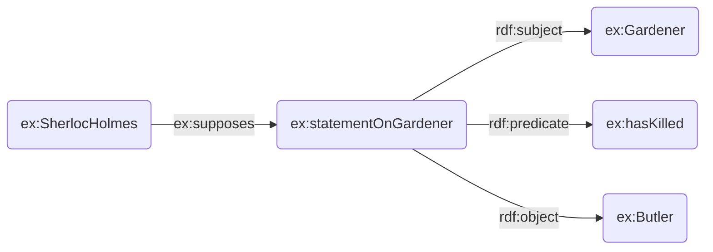
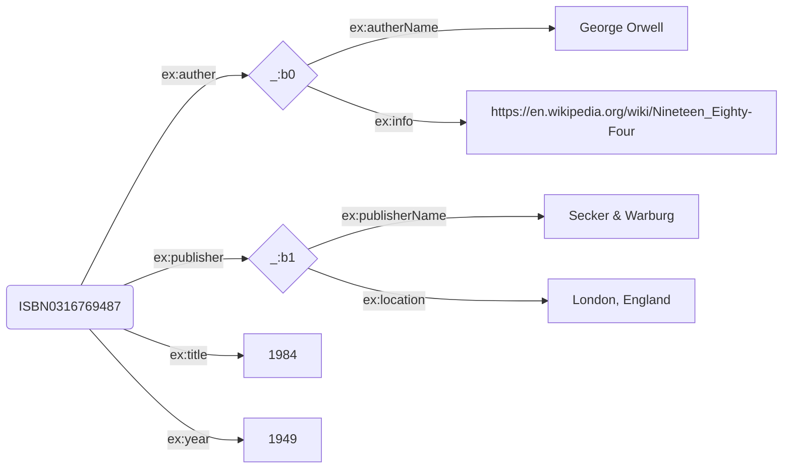
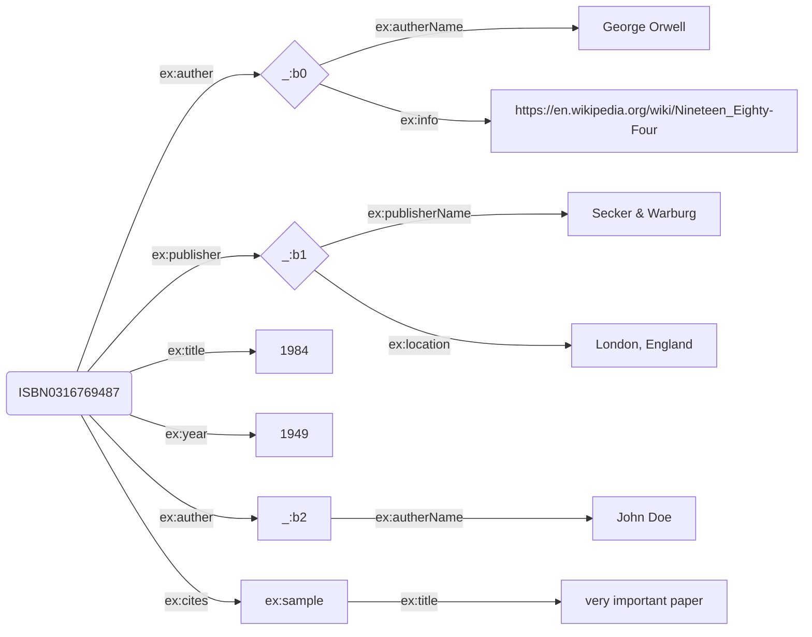

# How to represent facts (part4) :-

## RDF-Reification :-

> - RDF reification is a way to make statements about statements in RDF. This can be useful for expressing metadata about RDF statements, such as who made the statement, when it was made, or under what conditions.
>
> Example :-
>
> Sherlock Holmes supposes that the gardener has killed the Butler
>
> > - Part 1: The Gardener has killed the Butler.
> >   `ex:Gardener ex:hasKilled ex:Butler.`
> > - Part 2: Sherlock Holmes supposes.
> >   `ex:Sherlock Holmes ex:supposes ????.`

```
@prefix rdf: <http://www.w3.org/1999/02/> 22-rdf-syntax-ns#> .
@prefix ex: <http://example.org/> .

ex:SherlockHolmes ex:supposes ex:statementOnGardener .
ex:statementOnGardener a rdf:Statement ;
    rdf:subject ex:Gardener ;
    rdf:predicate ex:hasKilled ;
    rdf:object ex:Butler .
```



> - Reification involves creating a set of RDF triples that describe an RDF statement as a resource. Specifically, it involves four main components:
>
> 1. rdf:Statement: A class used to represent an RDF statement.
> 2. rdf:subject: A property used to specify the subject of the reified statement.
> 3. rdf:predicate: A property used to specify the predicate of the reified statement.
> 4. rdf:object: A property used to specify the object of the reified statement.

### Use cases for RDF Reification :-

> - Provenance :- Tracking who made a statement and when.
> - Trust :- Assessing the reliability or trustworthiness of a statement
> - Context :- Providing additional context about the circumstances under which statement was made.
> - Definition of Metadata about Statements (Assertions, Statements)
> - for (general) knowledge representation (Ontologie Construction)
> - Transformation of Relation into Classes

### Limitations :-

> - Reification can significantly increase the number of triples in an RDF dataset, making it more complex to manage and query.
> - However, reifying statements can sometimes create situations where the types assigned to reified statements conflict with the types expected by consuming applications or logical reasoning engines. Therefore, Reification can cause type conflicts (classes, individuals, statements)

## RDF and Data Integeration

Simple Example: Bibliography Database

Books:-
| ID | Auther | Title | Publisher | Year |
| :----------------:| :----------------:|:----: | :--------:|:----:|
| 0316769487 | GO-123 | 1984 | S-001 | 1949 |

Authers:-
| ID | Name | Info |  
| :----------------:| :----------------:|:-------------------------------------------------:|  
| GO-123 | George Orwell | https://en.wikipedia.org/wiki/Nineteen_Eighty-Four|

Publishers:-
| ID | Publisher | Location |
| :----------------:| :------------------------:|:----------------:|
| S-001 | Secker & Warburg | London, England |

```
@prefix ex: <http://example.org/> .

ex:ISBN 0316769487 ex:auther [
    ex:autherName "George Orwell" ;
    ex:info <https://en.wikipedia.org/wiki/Nineteen_Eighty-Four>
  ].

ex:0316769487 ex:publisher [
    ex:publisherName "Secker & Warburg" ;
    ex:publisherLocation "London, England"
  ].

ex:0316769487 ex:title "1984".
ex:0316769487 ex:year "1949".
```



What if later on we get additional data.

Books:-
| ID | Auther | Cite |
| :----------------:| :----------------:|:-------------------:|
| ISBN0316769487 | JD-111 | IO-110 |

Authers:-
| ID | Name |  
| :----------------:| :----------------:|  
| JD-111 | John Doe |

Cites:-
| ID | link | title |
| :----------------:| :------------------------------|:------------------:|  
| IO-110 | http://www.sample.org |very important paper|

```
@prefix ex: <http://example.org/> .

ex:ISBN0316769487 ex:auther [
    ex:autherName "George Orwell" ;
    ex:info <https://en.wikipedia.org/wiki/Nineteen_Eighty-Four>
  ].

ex:ISBN0316769487 ex:publisher [
    ex:publisherName "Secker & Warburg" ;
    ex:publisherLocation "London, England"
  ].

ex:ISBN0316769487 ex:auther [
    ex:autherName "John Doe" ;
].

ex:ISBN0316769487 ex:title "1984".
ex:ISBN0316769487 ex:year "1949".

ex:ISBN0316769487 ex:cites ex:sample.
ex:sample ex:title "very important paper".
```


